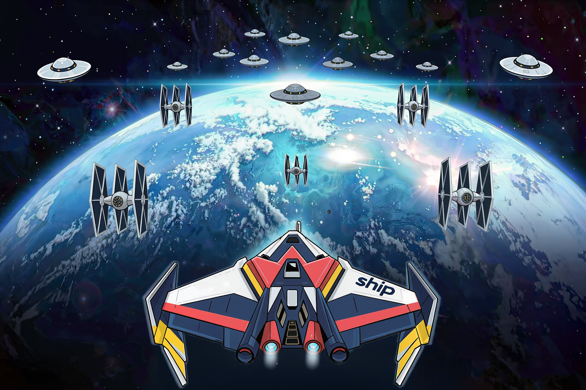

# 🚀 The Cyborg Hive of Nidai

  

  A 2D arcade shooter built with LibGDX.

---

## 🎮 About The Game

**The Cyborg Hive of Nidai** is a 2D space shooter where the player fights waves of UFO enemies, survives as long as possible, and manages their ship's health.

The game features:

- 🚀 Player-controlled spaceship
- 👽 Enemy UFO waves
- 💥 Explosion animations
- 🔫 Shooting mechanics
- ❤️ Health system
- 🎵 Sound effects and music settings
- ⚙️ Options menu with adjustable audio settings
- 🎮 Keyboard menu navigation

---

## 🕹️ Controls

| Key | Action |
|---|---|
| `SPACE` | Start game / Shoot |
| `LEFT` | Move left |
| `RIGHT` | Move right |
| `ESC` | Open options |
| `UP/DOWN` | Navigate menus |
| `ENTER` | Select menu item |

---

## 🖥️ Screenshots

  

  Gameplay

---

## 🛠️ Built With

- Java
- LibGDX
- Scene2D UI
- OpenGL rendering
- Gradle

---

## 🚀 Future Plans

The goal is to expand **The Cyborg Hive of Nidai** into a bigger arcade experience.

Planned features:

- 👾 New enemy types with different behaviors
- ⚡ Power-ups to improve the player's ship
- 🏆 High score and leaderboard system
- 👑 Boss fights with unique mechanics
- 🌌 Additional levels with increasing difficulty

## 📦 Running The Game

### Requirements

- Java JDK 17+
- Gradle

## 📜 License

The source code is available for viewing and learning purposes.

You may not copy, modify, redistribute, or use this project or its assets commercially.

## 🤝 Contributions

Suggestions and feedback are welcome. Please contact the author before submitting code contributions, as this project may become a commercial release in the future.
